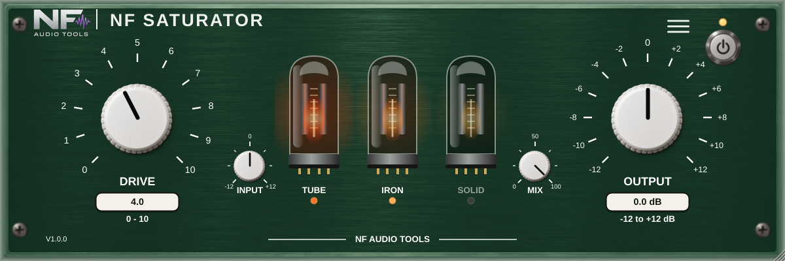

# NF Saturator

Simple valve-style saturator by **NF Audio Tools** (Nenno Fernando) for vocals, drums and everything else.
VST3, AU (macOS) and AAX (Pro Tools).

- **Drive** (0-10): how hard the "valves" are pushed. Level-compensated: Drive changes the character, not the loudness.
- **Three valves** (each on/off, any combination): **TUBE** (triode-style warmth, even harmonics), **IRON** (transformer-style
  weight, saturates the lows first), **SOLID** (transistor / op-amp style bite, odd harmonics). They emulate the *character*
  of these kinds of circuits, not any specific unit.
- **Warmth on each valve:** click a valve to switch it on/off; **drag it up** and the light gets hotter (orange to red-hot)
  while that valve's character grows (TUBE: more 2nd harmonic; IRON: a soft, fat, slightly resonant bass boost referenced to 100 Hz (about +6 dB there, +8 dB in the deep bass) and a darker top end; SOLID: rounder, with
  a touch of even harmonics). **Drag down** to cool it back to the base state; **Alt/Option-click** resets it.
- Opens at 810 x 270 by default; **double-click the NF logo** to return to that size.
- **Output** (-12..+12 dB), Power, **24 factory presets** (Voice incl. rock / pop / male / female, Mix, Master, Guitar, Drums) plus preset save/load. 4x oversampling.



## Quick VST3 build on macOS (to test in a DAW)
```
cmake -S . -B build -G Xcode
cmake --build build --config Release --target NFSaturator_VST3
```
Then copy `NF Saturator.vst3` (inside `build/NFSaturator_artefacts/Release/VST3/`) to `/Library/Audio/Plug-Ins/VST3/`.

## Tests
```
g++ -std=c++17 -O2 -Wall -Wextra Tests/SaturatorTests.cpp -o dsp_tests && ./dsp_tests
```

## Level-compensation table (only when the DSP changes)
Drive is level-compensated with `Source/DSP/CompTableData.h`, generated from the very same DSP code. If you change
`Source/DSP/SaturatorCore.h`, regenerate it (about 40 s) and run the tests, which fail if the table is stale:
```
g++ -std=c++17 -O2 Tools/GenCompTable.cpp -o gen && ./gen > Source/DSP/CompTableData.h
```
